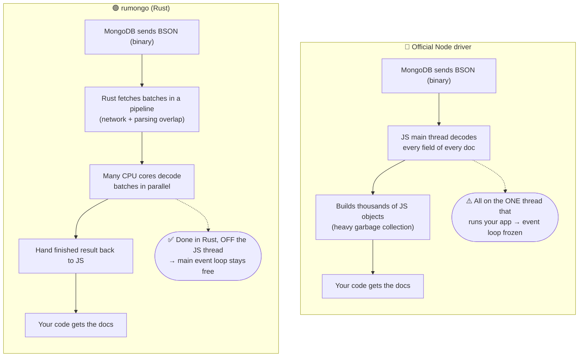
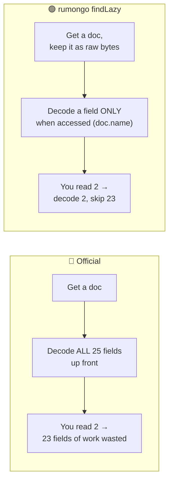
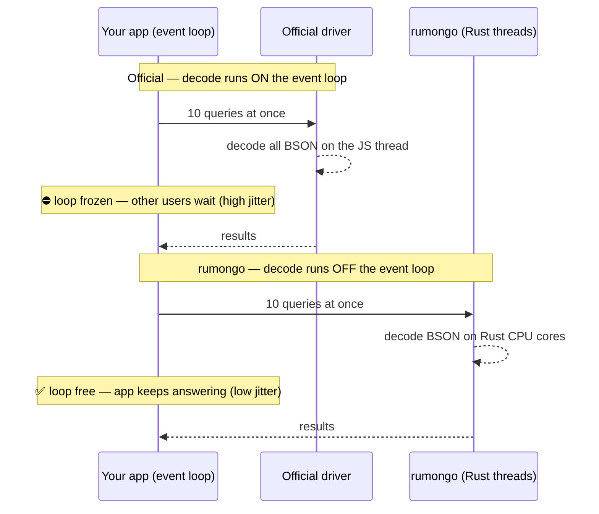

# rumongo

**Rust + Mongo.** A Rust-native MongoDB **read** driver for Node.js (napi-rs).
Faster reads than the official Node driver and Mongoose by doing BSON parsing in
Rust — pipelined fetch, off-thread parallel parse, and optional lazy zero-copy
field access.

> Read path only. Writes / hooks / virtuals / populate / validation are **not**
> covered — keep the official driver or Mongoose for those. See
> [MIGRATION.md](MIGRATION.md).

## Performance (local MongoDB, see [BENCHMARKS.md](BENCHMARKS.md))

- **1.6–3.7× faster reads** than the official Node driver (by projection width).
- **~2× vs Mongoose `.lean()`, ~5× vs hydrated Mongoose.**
- **~10× lower event-loop jitter** on a single query; **near-zero** with lazy or
  worker-thread offload.
- **7.3× vs the raw driver** when reading a few fields of a wide doc (lazy).

## How it works (in plain terms)

MongoDB sends every document over the wire as **BSON** — a compact binary blob.
Before your code can use it, something has to **decode** that binary into objects
you can read (`doc.name`, `doc.age`, …). The whole speed difference comes down to
two questions: **who** does the decoding (the single JavaScript thread, or many
Rust CPU cores) and **how much** it decodes (every field, or only the ones you touch).

### 1. A normal `find` — who decodes the data?

The official driver does all the binary→object work on the **one** thread that
also runs your entire app. rumongo hands that work to Rust, spread across CPU
cores, **off** the main thread — so your app stays responsive.



### 2. `findLazy` — how much does it decode?

Each document may have 25 fields, but your loop might read only 2. The official
driver decodes **all** of them up front. rumongo keeps the doc as raw bytes and
decodes a field **only when you touch it**.



### 3. Concurrent load — why "jitter" stays low

"Jitter" = how long the event loop froze, i.e. how unresponsive your app got to
*other* users while a query was being decoded. Under many concurrent queries the
official driver piles every decode onto the single JS thread; rumongo keeps that
work in Rust, off-thread.



**One line:** the official driver does *all* the binary→object work on the single
thread that also runs your whole app; rumongo pushes that work into Rust on
multiple cores, off the main thread, and — in lazy mode — only does the part you
actually use.

## Install / build

```bash
npm install          # deps
npm run build        # compile the Rust addon (release) -> rumongo.<platform>.node
npm run build:ts     # compile the TypeScript layer -> dist/
```

Requires a Rust toolchain and a reachable MongoDB. Target: linux-x64 (current).

## Usage

```js
import { MongoClient } from 'rumongo'

const client = await MongoClient.connect('mongodb://localhost:27017', {
  maxPoolSize: 20,
  serverSelectionTimeoutMs: 5000,
})
const users = client.collection('app', 'users')

// eager: plain JS objects
const all = await users.find({ active: true }, { sort: { age: -1 }, limit: 100 })

await client.close() // IMPORTANT: stops background monitors so the process exits
```

### Three read APIs (pick by shape)

| API | use when |
|---|---|
| `collection.find(filter, opts)` | small/medium results; returns plain objects |
| `collection.findLazy(filter, opts)` | wide docs, few fields read — fields parse on access |
| `collection.findCursor(filter, opts)` → `nextBatch()` | large/streaming results; bounded memory |

```js
// lazy: only the fields you touch are parsed
const docs = await users.findLazy({}, { limit: 1000 })
for (const d of docs) console.log(d.name) // parses just `name`

// streaming cursor: process a batch at a time (bounded memory)
const cur = await users.findCursor({}, { batchSize: 1000 })
let batch
while ((batch = await cur.nextBatch()) !== null) {
  for (const d of batch) process(d)
}
```

### Mongoose-style Model (projection pushdown)

```js
import { Model } from 'rumongo'
const User = Model.define(users, { name: 1, age: 1 }) // schema fields = projection
await User.find({ age: { $gte: 18 } }, { sort: { age: 1 } })
await User.findOne({ name: 'Ann' })
await User.findById('507f1f77bcf86cd799439011') // 24-char hex string
```

### Filters with BSON types (Extended JSON)

Filters cross the JS↔Rust boundary as JSON, so use Extended JSON for BSON types:

```js
await users.find({ _id: { $oid: '507f1f77bcf86cd799439011' } })
```

### Worker pool (opt-in) — keep the main loop free under heavy load

Run aggregation/transform work inside worker threads; only the result returns to
main, so the event loop stays responsive. Best for "do the work, return a small
result" (counts, sums, transforms, exports).

```js
import { WorkerPool } from 'rumongo'
const pool = await WorkerPool.create({ uri, size: 6 })
const { acc } = await pool.reduce('app', 'users', { active: true }, {}, (a, d) => a + d.age, 0)
await pool.close()
```

### Shadow mode — validate before cutover

Run rumongo alongside the official driver, compare, log divergences, but always
return the official result.

```js
import { shadow } from 'rumongo'
const res = await shadow(
  () => rumongoColl.find(q),
  () => officialColl.find(q).toArray(),
  (diff) => logger.warn('divergence', diff),
)
```

## Debugging

Set `RUMONGO_DEBUG=1` to log each query's collection, doc count, and elapsed time
to stderr.

## Tests

```bash
node --test __tests__/parity/        # 23 parity tests vs official driver
node --test __tests__/model/         # 9 Model tests vs Mongoose
node --test __tests__/lazy/          # lazy field-access tests
node --test __tests__/integration/   # connectivity, pipeline, leak
node bench/suite.js                  # benchmark suite
```

## License

MIT
